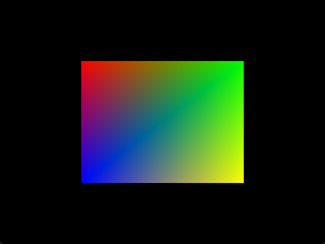

# Square

This example demonstrates how to render a colored square with smooth color interpolation between
vertices.

## Features

- Renders a colored square on screen using vertex and fragment shaders
- Uses separate vertex buffers for position and color data
- Implements a triangle strip topology for efficient quad rendering

## Running

To build and run this example:

```shell
build.bat|sh 03_square run
```

## Screenshots


